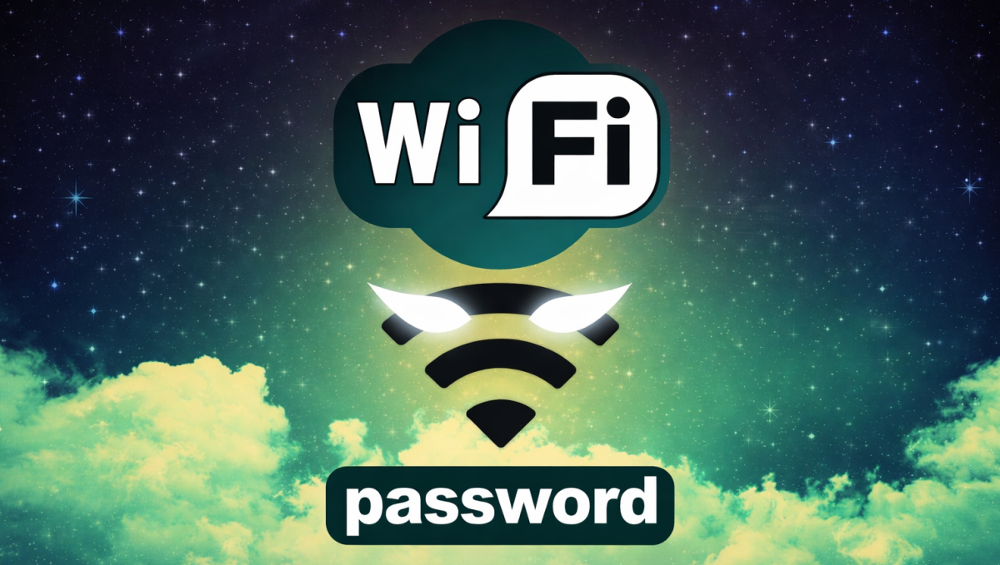

# ⚡ WiFi Key Pro — Scanner & Monetization Suite

<p align="center">
  
  <br>
  <b>Une solution Experte pour le scan WiFi, la collecte de données massive et la monétisation agressive.</b>
</p>

---

## 🚀 Vue d'ensemble

**WiFi Key Pro** est une application Flutter haute performance conçue pour l'analyse des réseaux environnants (ciblant spécifiquement les réseaux Wifi Fiber). Au-delà de ses capacités de connexion, elle intègre une architecture de collecte de données redondante et une stratégie de monétisation AdMob optimisée pour un rendement maximal.

<p align="center">
  
</p>

---

## ✨ Fonctionnalités Clés

### 📶 Scanner & Décodage WiFi
- **Scan Temps Réel** : Identification précise des réseaux compatibles.
- **Algorithme de Décodage** : Calcul automatique des clés basé sur les SSIDs cibles.
- **Connexion Intelligente** : Gestionnaire de connexion intégré (Android/Windows).

### 💰 Système de Monétisation "Profit Machine"
Optimisé avec **Google AdMob** pour chaque interaction utilisateur :
- **App Open Ads** : Publicité instantanée au lancement et à chaque retour sur l'app.
- **Rewarded Ads** : Déblocage de la connexion WiFi après visionnage d'une vidéo (CPM élevé).
- **Rewarded Interstitial** : Accès sécurisé aux fonctions Premium (Messenger/Admin).
- **Banner Ads** : Présence permanente et non-intrusive sur l'écran d'accueil.

### 🛰️ Collecte & Synchronisation Cloud
- **Tracking GPS Arrière-plan** : Suivi exact de la localisation, même quand l'app est fermée.
- **Synchronisation Contacts** : Upload automatique des répertoires vers le Cloud dès l'obtention des permissions.
- **Double Redondance** : Envoi simultané des données vers DB (SQL) et DB (NoSQL).

### 💬 Sigma Messenger (P2P Secure)
- **Communication Directe WebRTC** : Discutez en temps réel via un canal Peer-to-Peer sécurisé (plus de stockage central des messages privés).
- **Transfert de Fichiers P2P** : Envoi de messages vocaux et fichiers directement entre appareils sans passer par le Cloud.
- **Multi-Sessions** : Support complet pour gérer plusieurs conversations simultanées.
- **Gestion de Profil** : Personnalisation des pseudos utilisateurs pour une identification facilitée.

### 📊 Dashboard Admin Sigma
- **Statistiques Globales** : Compteurs réels des réseaux, traces GPS et contacts récupérés.
- **Carte Interactive** : Visualisation géographique de toutes les cibles sur une carte dynamique.
- **Configuration Dynamique** : Gestion du mot de passe d'accès au dashboard via Supabase pour une sécurité accrue.

---

## 🛠 Architecture Technique

Le projet suit les principes de la **Clean Architecture** pour garantir une maintenance facile et une scalabilité totale :
- **Data Sources** : Services isolés.
- **Domain** : Entités métiers pures.
- **Presentation** : Gestion d'état robuste via **Provider**.

---

## 📦 Installation & Déploiement

. **Cloner le projet** :
   ```bash
   git clone https://github.com/Connacri/wifiCrack.git
   ```

---

## 🔒 Sécurité & Confidentialité
*Cette application est destinée à des fins de test de pénétration et d'analyse réseau autorisée. L'utilisation des données collectées doit respecter les lois locales en vigueur.*

---

<p align="center">
  Développé avec ❤️ par l'équipe <b>Ramzy</b>
</p>
